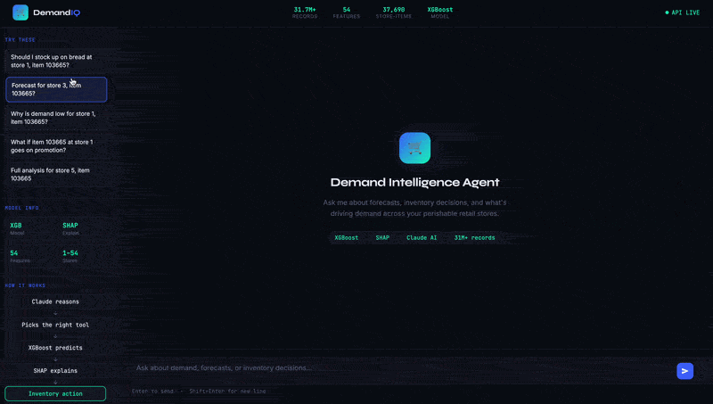

# 🛒 Demand Intelligence Agent

An end-to-end **agentic AI system** for perishable retail demand forecasting. Combines a production-grade **XGBoost model** trained on 31.7M+ records with a **Claude-powered ReAct agent** that reasons, calls tools, and delivers plain-English inventory recommendations.

> Built to simulate a real enterprise AI deployment — the kind you'd find at a grocery chain managing perishable waste and stockout risk.

---
## Related Repository

This is **Part 2** of a two-part project.

| Part | Repo | Description |
|---|---|---|
| 1 | [perishable-retail-forecasting-pipeline](https://github.com/keerthanajai/Perishable-retail-forecasting-pipeline) | PySpark preprocessing, feature engineering, and model training across 8 data sources and 31.7M+ records |
| 2 | **demand-intelligence-agent** *(this repo)* | Claude-powered ReAct agent with XGBoost inference, SHAP explainability, and FastAPI backend |

> The preprocessing pipeline in Part 1 produced the feature store and model artifacts that power this agent.

## Demo



**Example queries you can ask:**
- *"Should I stock up at store 51, item 1239986?"*
- *"Why is demand high at store 44, item 1503844?"*
- *"What if store 44, item 1473474 goes on promotion?"*
- *"Full analysis for store 11, item 584126"*

---

## Architecture

```
User (Chat UI)
      │
      ▼
FastAPI Backend (/chat)
      │
      ▼
Claude ReAct Agent  ──── reasons about the question
      │
      ├── forecast_demand    ──► XGBoost model inference
      ├── explain_forecast   ──► SHAP feature importance
      ├── query_sales_history──► Feature store lookup
      └── recommend_action   ──► Forecast + SHAP + business rule
                                        │
                                        ▼
                              Plain-English Recommendation
                              (STOCK UP / MAINTAIN / REDUCE ORDER)
```

### Tech Stack

| Layer | Technology |
|---|---|
| LLM Agent | Claude (Anthropic) — tool-calling + ReAct loop |
| ML Model | XGBoost — trained on 31.7M records |
| Explainability | SHAP TreeExplainer |
| Backend API | FastAPI |
| Data Pipeline | PySpark (8 sources, 31.7M+ records) |
| Data Warehouse | Snowflake + dbt |
| Frontend | Vanilla HTML/CSS/JS |

---

## Model Performance

Trained on the [Favorita Grocery Sales](https://www.kaggle.com/c/favorita-grocery-sales-forecasting) dataset (Ecuador, 2013–2017).

| Metric | Baseline (lag_7) | XGBoost Model | Improvement |
|---|---|---|---|
| MAE | — | — | **36.5% reduction** |
| RMSE | — | — | **55% reduction** |
| Features | 1 | 54 | — |

**Key features engineered:**
- Lag features (7, 14, 28, 365 days)
- Rolling statistics (mean, std, max, min)
- Promotion timing (days since / days to next promo)
- Weather signals (temperature, humidity, rainfall)
- Economic indicators (oil price, import/export values)
- Holiday flags (national, regional, local)
- Leakage-free group averages (store × day-of-week, item × month)

---

## Agent Tools

The LLM agent autonomously decides which tools to call:

```python
forecast_demand      # XGBoost inference → predicted unit sales
explain_forecast     # SHAP → top 5 drivers in plain English  
query_sales_history  # Feature store → recent sales context
recommend_action     # Full analysis → STOCK UP / MAINTAIN / REDUCE ORDER
```

---

## Project Structure

```
demand-intelligence-agent/
├── api/
│   ├── main.py          # FastAPI routes + /chat + /reset
│   ├── predictor.py     # Model loading + inference
│   └── explainer.py     # SHAP explanations
├── agent/
│   ├── agent.py         # ReAct loop (Claude tool-calling)
│   ├── tools.py         # Tool definitions + execution
│   └── memory.py        # Conversation history
├── ui/
│   └── index.html       # Chat interface (served by FastAPI)
├── data/
│   ├── sample_features.parquet   # Feature lookup (latest state per store+item)
│   └── model_artifacts/
│       ├── demand_model.pkl
│       └── feature_list.pkl
├── tests/
│   └── test_tools.py
└── notebooks/
    └── Capstone_model.ipynb      # Full training pipeline
```

---

## Quickstart

### 1. Clone & install

```bash
git clone https://github.com/YOUR_USERNAME/demand-intelligence-agent
cd demand-intelligence-agent

python3 -m venv venv
source venv/bin/activate
pip3 install -r requirements.txt
```

### 2. Set up environment

```bash
cp .env.example .env
# Add your Anthropic API key to .env
```

### 3. Run the API

```bash
python3 -m uvicorn api.main:app --reload
```

### 4. Open the UI

```
http://127.0.0.1:8000/ui
```

---

## Example Agent Interaction

```
You: Should I stock up at store 51, item 1239986?

🔧 Calling tool: recommend_action
✅ Tool result: RECOMMENDATION: STOCK UP
   Forecast: 1,312 units | 18.4% above recent average
   Top drivers: 7-day rolling average (2,574), weekend effect, no active promotion

Agent: Yes, stock up. Forecast for store 51 is 1,312 units — 18% above 
       recent trend. The main driver is strong baseline demand (7-day avg: 
       2,574 units). Since there's no active promotion, this is organic demand. 
       Recommend increasing your order by ~20% to avoid stockout risk.
```

---

## Data Pipeline

The model was trained on 8 integrated data sources using PySpark:

| Source | Records | Description |
|---|---|---|
| Sales transactions | 125M+ | Store × item × day |
| Store metadata | 54 stores | City, cluster, type |
| Item metadata | 4,100 items | Family, perishable flag |
| Oil prices | Daily | Ecuador economic indicator |
| Holidays | — | National, regional, local |
| Weather | Daily | Temp, humidity, rainfall |
| Import/export trade | Monthly | HS code level |
| Agricultural production | Annual | Bananas, dairy, meat |

**19 automated data quality checks** covering null validation, duplicate detection, and referential integrity across 3.3M rows before loading.

---

## What Makes This Production-Grade

- **Leakage-free training** — group averages computed on training data only, then merged onto full dataset
- **Log-target transformation** — trained on `log1p(unit_sales)`, predictions transformed back with `expm1`
- **Memory-aware agent** — handles multi-turn follow-ups ("now do that for store 5")
- **SHAP explainability** — every prediction comes with a business-readable explanation
- **Tool-calling architecture** — agent autonomously chains tools, not hardcoded pipelines
- **FastAPI backend** — deployable, documented, testable via `/docs`

---

## Environment Variables

```
ANTHROPIC_API_KEY=your_key_here
```

---

## Author

**Jaikeerthana Periyasamy**  
[LinkedIn](https://www.linkedin.com/in/jai-keerthana-parthasarathy-a9358133b) · [GitHub](http://github.com/keerthanajai)